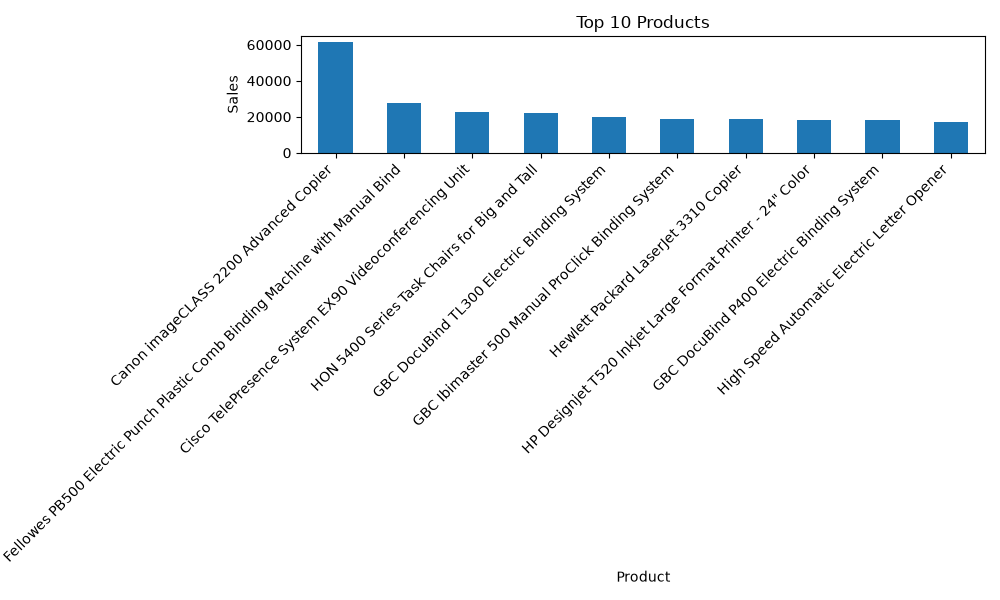
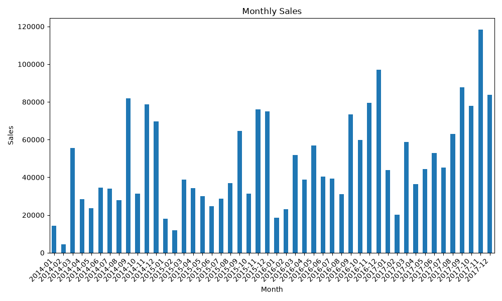

# Sales Data Analysis

This project analyzes sales data using Python and Pandas.

## Features

- Load CSV
- Clean Data
- Sales Analysis
- Export Results

## Technologies

- Python
- Pandas

## Dataset

Sample Superstore Dataset (Kaggle)

## Project Structure

```text
src/
data/
output/
```

## Visualization

### Top 10 Products



### Profit by Region


### Monthly Sales

