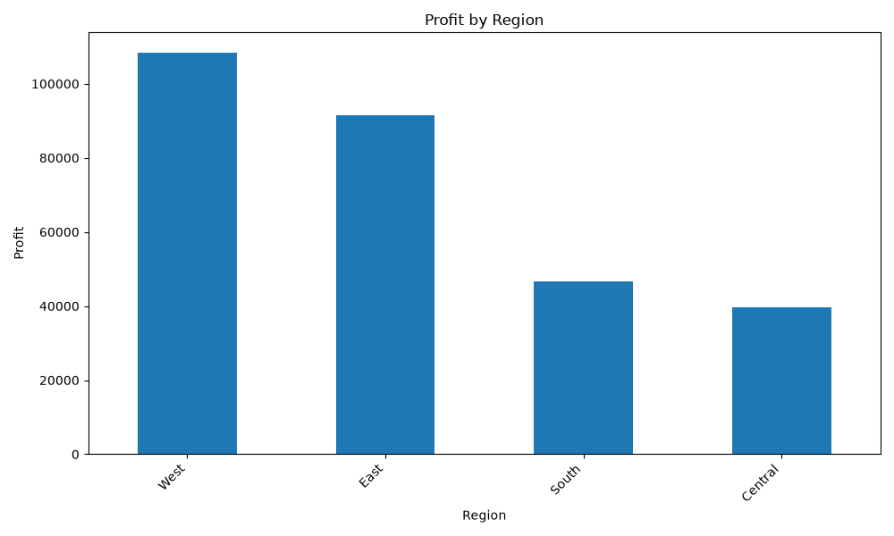

# Sales Data Analysis

A simple data analysis project built with **Python**, **Pandas**, **Matplotlib**, and **Docker**. The project loads a sales dataset, performs data cleaning and analysis, generates visualizations, and exports summary reports.

---

## Features

- Load sales data from CSV
- Clean and preprocess data
- Analyze sales performance
- Top 10 Products analysis
- Profit by Region analysis
- Monthly Sales trend analysis
- Export analysis results to CSV
- Data visualization with Matplotlib
- Dockerized application for reproducible execution

---

## Technologies

- Python
- Pandas
- Matplotlib
- Docker
- Docker Compose

---

## Dataset

Sample Superstore Dataset (Kaggle)

---


## Workflow

```text
CSV Dataset
     │
     ▼
Load Data
     │
     ▼
Data Cleaning
     │
     ▼
Data Analysis
     │
     ├── Top Products
     ├── Monthly Sales
     └── Profit by Region
     │
     ▼
CSV Reports + Charts
```

## Project Structure

```text
sales-data-analysis/
│
├── assets/                 # Images for README
├── data/                   # Raw dataset
├── output/                 # Generated CSV reports
├── src/
│   ├── analyze.py
│   ├── clean_data.py
│   ├── export.py
│   ├── load_data.py
│   └── main.py
│
├── Dockerfile
├── docker-compose.yml
├── requirements.txt
├── .dockerignore
├── .gitignore
└── README.md
```

---

## Generated Reports

The application exports several CSV reports:

- Top Customers
- Top Products
- Monthly Sales
- Profit by Region

---

## Visualization

### Top 10 Products


### Profit by Region



### Monthly Sales


---

## Run Locally

Create a virtual environment

```bash
python -m venv venv
```

Activate the environment

Linux / macOS

```bash
source venv/bin/activate
```

Windows

```powershell
venv\Scripts\activate
```

Install dependencies

```bash
pip install -r requirements.txt
```

Run the application

```bash
python src/main.py
```

---

## Run with Docker

Build the Docker image

```bash
docker build -t sales-analysis .
```

Run the container

```bash
docker run --rm \
-v $(pwd)/output:/app/output \
sales-analysis
```

Or use Docker Compose

```bash
docker compose up
```

---

## Sample Output

The generated reports are saved in the `output/` directory after execution.

## Future Improvements

- Load data from SQL databases
- Build automated ETL pipeline
- Add unit tests
- Integrate Apache Airflow
- Store processed data in PostgreSQL
- Process large datasets with PySpark
- Deploy using CI/CD
